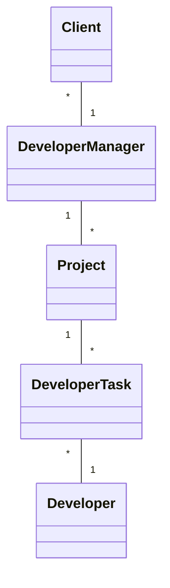
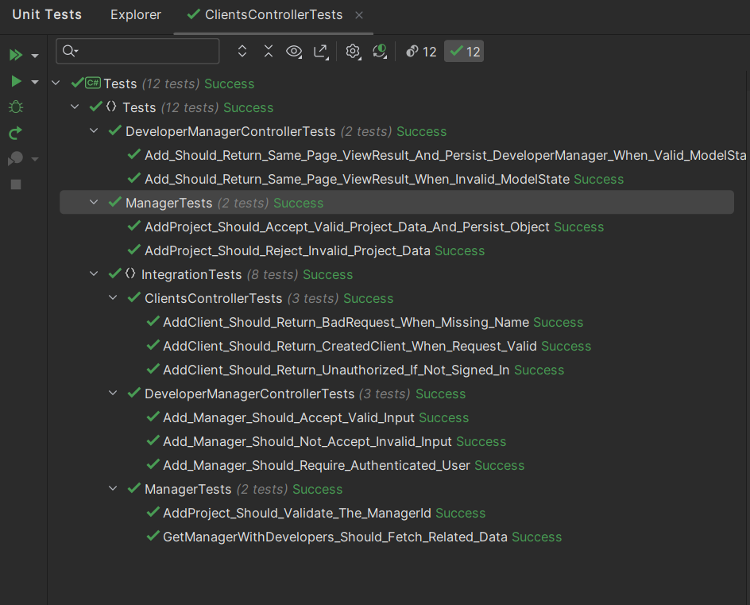

# Project .NET Framework

* Naam: Said Khalaf
* Studentnummer: 015991054
* Academiejaar: 23-24
* Klasgroep: INF203A
* Onderwerp: Client *_1 Manager *_* Developer

## Sprint 3

### Beide zoekcriteria ingevuld
```sql
SELECT "d"."Id", "d"."JoinDate", "d"."Name", "d"."PhoneNr", "d"."ProgrammingLanguage", "d"."ProjectStatus", "d"."Salary"
FROM "Developers" AS "d"
WHERE "d"."Name" = @__name_0 AND "d"."ProgrammingLanguage" = @__programmingLanguage_1
```

### Enkel zoeken op DeveloperName 
```sql
SELECT "d"."Id", "d"."JoinDate", "d"."Name", "d"."PhoneNr", "d"."ProgrammingLanguage", "d"."ProjectStatus", "d"."Salary"
FROM "Developers" AS "d"
WHERE "d"."Name" = @__name_0
```

### Enkel zoeken op ProgrammingLanguage
```sql
SELECT "d"."Id", "d"."JoinDate", "d"."Name", "d"."PhoneNr", "d"."ProgrammingLanguage", "d"."ProjectStatus", "d"."Salary"
FROM "Developers" AS "d"
WHERE "d"."ProgrammingLanguage" = @__programmingLanguage_0
```

### Beide zoekcriteria leeg
```sql
SELECT "d"."Id", "d"."JoinDate", "d"."Name", "d"."PhoneNr", "d"."ProgrammingLanguage", "d"."ProjectStatus", "d"."Salary"
FROM "Developers" AS "d"
```

## Sprint 4




## Sprint 6

### Nieuwe Client

#### Request

```http request
POST http://localhost:5085/api/Clients
Content-Type: application/json
Accept: application/json
```

#### Response

```http request
HTTP/1.1 201 Created
Content-Type: application/json; charset=utf-8
Date: Thu, 28 Dec 2023 18:46:07 GMT
Server: Kestrel
Location: http://localhost:5085/api/Clients/333334
Transfer-Encoding: chunked

{
  "id": 333334,
  "name": "said",
  "birthDate": "1998-02-17T00:00:00",
  "email": "said.khalaf1998@gmail.com"
}
Response file saved.


```

## Sprint 7

### Admin: said@kdg.be Password1!
### User: jan@kdg.be Password1!
### User: peter@kdg.be Password1!
### User: tobias@kdg.be Password1!
### User: sami@kdg.be Password1!

#### Request 1
```http request
### Does not work

POST https://localhost:7200/api/Clients
Content-Type: application/json
Accept: application/json

{
  "id" : 33333333,
  "name": "Said",
  "birthDate": "1998-02-17",
  "email": "said.khalaf1998@gmail.com",
  "managerId": 111
}
```

#### Response
```http request
HTTP/1.1 401 Unauthorized
Content-Length: 0
Date: Sat, 09 Mar 2024 22:54:52 GMT
Server: Kestrel
Location: https://localhost:7200/Identity/Account/Login?ReturnUrl=%2Fapi%2FClients
```

#### Request 2

```http request
### it works

#@no-redirect
#@no-cookie-jar
POST https://localhost:7200/api/Clients
Accept: application/json
Content-Type: application/json
Cookie: .AspNetCore.Antiforgery.yoNvFOGupyE=CfDJ8GKdn1u0PbNAgEJaMIPSeZiWGSL4GToasJVcZSEQ1BVLyoyM1cUo5n1fD1TqPzgVuZ3Uncrat411tL9HejoQntG-LOVVDbWBVnjudXTflpV70HMVfsUyUKjKJZGmWgv-zup5rjH0z5_aqsIYyih332A; .AspNetCore.Identity.Application=CfDJ8GKdn1u0PbNAgEJaMIPSeZiB4Wz5FFh9_OIQ8fLI9NttDKJ9b50aCsS76_fI0Lu57uQcj75yHJJxIJl4VtUjtrWkCUAWBLS9-1hr_Ir4kjnwWSIoaOEfqRgDvWkpxrzQ_bg_qrpH8K1WeJyJxeOInx_CC8hqJoWcAIXdHDF90Tf_J8XeL5NR7LwQmIPnx096Nx0FjTk9S9j8Jj9CRUJWyG4IekDSyHoUXsnv0LS6C3EnyHpjvol_M9rFsghYmlyGSlix5If3PmBg4Ryise5I90fo53wJvIXvqPZyG9kPCJ-4AZ0YqSf2uyW0twtNGfhF8l6iePaifZknji23phh68uXzYsHikdRwT16MoY44O3ivX63yWX2LxKXuaFrHjFoJ3tXPqOgryjb4AkuTmKB3itcovrddzDgbquiehLqdpcY_bZxW7CU0GG-U3OsfwMIY_VWygIPQSZAZQKawcDnocPNyL-KNKS95EYzam7b1sGMQCtyAHyqgOp45GW96ycpk4NeOMdLGss1E43c9pwnYu4_XhsJ_OoJbykCYmgyqkkF4j4W3_q9Q_6OTW3I5aCvMJ6NzCKDiUSQGkbnJrpoV8Ig6chvBN1_Ce_1Ky_-JJN9LcGxuZrWXeSqfdeQFkHPrrWtfNPjkKbRN-ERZq-_vo9lwA4VzrdZpBZVkrjGn6i_KEjjxyNZKg0qlpWC_xV9wKiDubgVF7aBeO-YD3jgh7DKErjy81YInf5194myE5DnCLS8lmqKBLv99R_RaNAbhMiR254h1jwWLpvDXPThG_kp_MPjx7dXyVeeR8ZZroQCkG5cmM2rBtfwYGy8z9Wz3MA

{
  "id": 22222,
  "name": "Muhareb",
  "birthDate" : "1965-04-21T00:00:00",
  "email": "Ibrahim123@gmail.com",
  "managerId": 1111
}
```

#### Response 
```http request
HTTP/1.1 201 Created
Content-Type: application/json; charset=utf-8
Date: Sat, 09 Mar 2024 23:01:56 GMT
Server: Kestrel
Location: https://localhost:7200/api/Clients/333334
Transfer-Encoding: chunked

{
  "id": 0,
  "name": "Muhareb",
  "birthDate": "1965-04-21T00:00:00",
  "email": "Ibrahim123@gmail.com"
}
```

## Sprint 8


```shell
dotnet test
```




* Voor de complexe autorisatievereisten wordt de klasse "ClientsControllerTests" gebruikt.


* Voor het testen met behulp van "verification" wordt de klasse "ManagerTests" gebruikt.


* Voor het testen van ModelState wordt de klasse "DeveloperManagerControllerTests" gebruikt.

[Pipelines](https://gitlab.com/kdg-ti/programmeren-2---.net/23-24/inf203/projecten/said.khalaf/-/pipelines)

